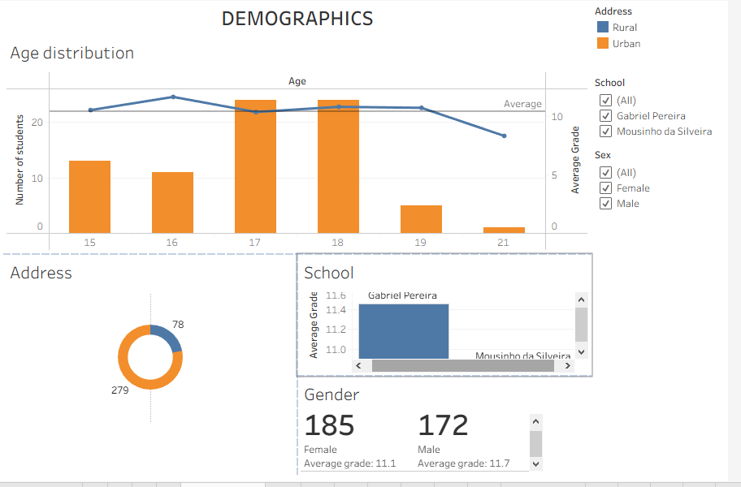
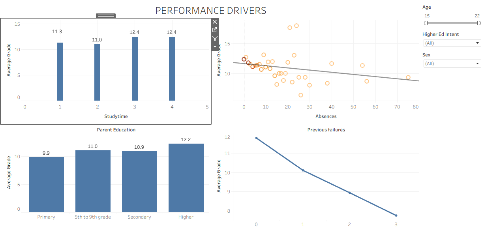
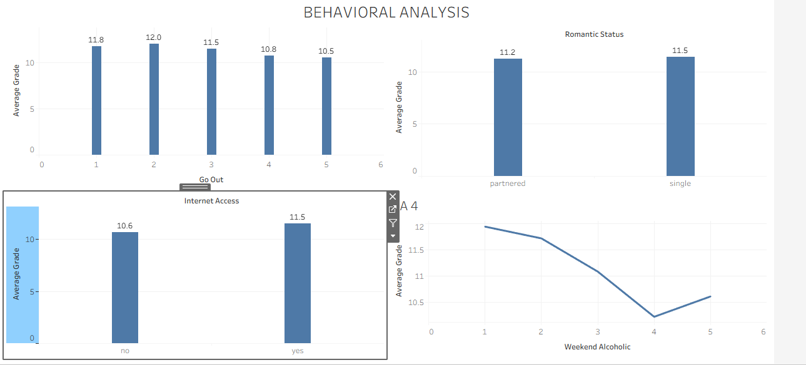
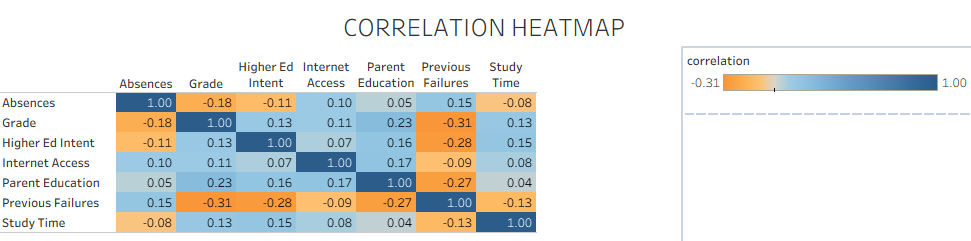

## Interactive Dashboard
Explore the full interactive visualization on Tableau Public:
[View the Student Performance Dashboard Here](https://public.tableau.com/app/profile/samuel.obinna8332/viz/Student-Performance-Analysis/Performancedrivers)

## KEY DEMOGRAPHICS INSIGHT
- Most students are between the ages 17 and 18
- There is a sharp drop-off in the number of students at age 19, and very few are 21.
- Older students generally exhibit lower academic performances
- More than 75% of students reside in the Urnab areas
- The gender split is relatively balanced, with slightly more female students (185) than male students (172).
- Male students slighty outperform female students
- Performance and population difference between schools may suggest potential variations in learning environments

## Key Insights
Higher study time is associated with better academic performance.
Students with more absences generally achieve lower grades.
Parent education shows a positive relationship with student achievement.
Previous failures are the strongest predictor of poor academic performance.

## Recommendation
Focus interventions on reducing absenteeism and providing additional support to students with prior failures, while encouraging effective study habits and parental engagement.
## Executive Summary
Previous failures and absenteeism are the strongest negative drivers of student performance, while study time and parent education positively influence academic outcomes.

## Key Insights
Students who go out more frequently tend to achieve slightly lower grades.
Weekend alcohol consumption shows a negative relationship with academic performance.
Students with internet access perform better on average than those without access.
Romantic relationship status has little to no significant impact on academic outcomes.

## Recommendation
Promote balanced social activities and healthy lifestyle habits while improving access to educational resources such as internet connectivity. Academic support efforts should focus on behavioral factors that show stronger links to performance.
## Executive Summary
Lifestyle behaviors such as frequent social outings and alcohol consumption are associated with lower academic performance, while internet access appears to support better outcomes. Romantic relationship status shows minimal influence on student achievement.

## Key Insights
- Past academic struggles ("Previous Failures") are the strongest predictor of poor current grades, while higher "Parent Education" is the strongest driver of academic success.
- High absences directly lower grades, whereas increased study time slightly improves grades and college ambition.
- Past academic struggles heavily dampen future ambition; students with previous failures are significantly less likely to aim for college.
- Students with a history of failure tend to skip class more often and dedicate less time to studying, compounding their academic risk.
- Students are more likely to target higher education if they come from households with higher educational backgrounds.
- students who plan to pursue higher education back up that ambition by dedicating slightly more time to studying

## Recommendations
- Implement proactive counseling for students with a history of "Previous Failures."
- Since "Parent Education" strongly dictates academic success, provide targeted mentorship and resources for first-generation students or those lacking strong educational support at home.
- Academic performance peaks at age 16, and enrollment drops sharply after age 18. Introduce engagement and career-planning programs targeting older teens to prevent performance drop-offs.
- Treat absences not just as a disciplinary issue, but as a primary warning sign for falling grades and a symptom of broader academic disengagement.
