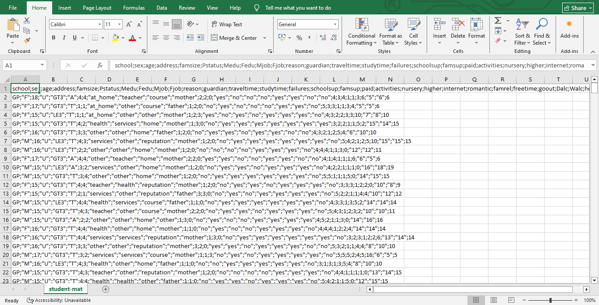
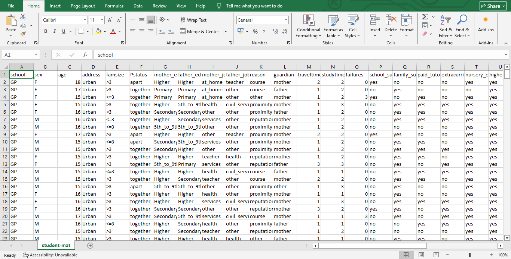

# Data Cleaning & Preparation Process (Microsoft Excel)

## Overview

This document outlines the complete data cleaning and preparation process carried out in Microsoft Excel before exploratory data analysis was performed on the student performance dataset.
The objective of the cleaning process was to improve readability, maintain data integrity, standardize categorical values, and prepare the dataset for analysis and visualization.

### 📊 Visualizing the Transformation

**Before: The Raw Dataset**

**After: The Cleaned Dataset**

# Data Cleaning Steps

## 1. Created a Backup of the Raw Dataset

Before making any modifications, a backup copy of the original dataset was created to preserve the raw data.

## 2. Converted Raw Text into Structured Columns

The dataset initially required formatting adjustments for usability.

### Action Taken
- Used Excel’s "Text to Columns" tool to properly separate and structure the dataset into usable columns.

### Excel Feature Used
- Data → Text to Columns

## 3. Standardized Address Values
The `address` column contained abbreviated categorical values.
### Original Values

- `U`

- `R`

### Cleaned Values

- `Urban`

- `Rural`

### Reason

Improved readability during analysis and visualization.

## 4. Cleaned Family Size Categories

The `famsize` column contained coded values that were less intuitive.

### Action Taken

Converted abbreviated categories into more understandable mathematical ranges.

Example:

- `LE3` → `<=3`

- `GT3` → `>3`

### Excel Feature Used
IFS(
    E2="LE3", "<=3", 
    E2="GT3", ">3", 
)

## 5. Standardized Parent Status Values

The `Pstatus` column contained abbreviated categorical labels.

### Original Values

- `T`

- `A`
### Cleaned Values

- `Together`

- `Apart`
### Excel Feature Used
Find and replace (Ctrl + H)

## 6. Renamed Columns for Clarity

Several columns were renamed using a consistent `snake_case` naming convention to improve readability and compatibility with analytical tools.

### Examples

| Original Column | Renamed Column |

| paid | paid_tutoring |

| activities | extracurricular_activities |

| higher | higher_ed_intent |

| internet | internet_access |

| romantic | in_relationship |

## 7. Mapped Numerical Codes to Descriptive Categories

Several columns used numerical codes to represent categorical information.

### Action Taken

Mapped the numerical values to descriptive educational categories to improve interpretation.

### Example

Parental education codes:

- `0` → None

- `1` → Primary Education

- `2` → 5th to 9th Grade

- `3` → Secondary Education

- `4` → Higher Education
### Excel Feature Used
=SWITCH(A2, 
    0, "None", 
    1, "Primary Education", 
    2, "5th to 9th Grade", 
    3, "Secondary Education", 
    4, "Higher Education", 
    "Unknown"
)

## 8. Standardized Parent Education Labels

To improve compatibility with SQL and other analytical tools, categorical labels were standardized using underscore formatting instead of spaces.

### Example

- `higher education` → `higher_education`
### Reason
This reduces issues during querying and data processing.

## 9. Improved School Selection Labels

The value "home" under the "reason" attribute was replaced with the more descriptive label "proximity" for improved contextual clarity.

## 10. Data Integrity Review

A review was conducted on the relationship between the `guardian` and `Pstatus` columns.
### Consideration
The possibility of modifying guardian attribute based on parental status was evaluated. I considered changing the value under the guardian to "both" if the value of the Pstatus column was "together".
### Decision
The transformation was intentionally not performed to preserve data granularity and avoid introducing assumptions into the dataset.

## 11. Standardized Relationship Status Values

The `romantic` column was fully restructured for clarity and professionalism.
### Changes Made
Header renamed:
- `romantic` → `in_relationship`

## 12. Improved Ambiguous Headers

Several columns contained abbreviated or unclear names.

### Columns Updated
- `Dalc` → 'workday_alcoholic 

- `Walc` → 'weekend_alcoholic'

- `health` → 'health_status'

## 14. Checked for Missing Values

The dataset was scanned for blank or null values.

### Excel Feature Used

- Go To Special → Blanks

## 15. Removed Duplicate Records

The dataset was checked for duplicate student entries.

### Excel Feature Used

- Remove Duplicates

## 16. Adjusted Spreadsheet Formatting

After renaming columns and expanding values, some text exceeded the default cell width.

### Action Taken

Applied:

- AutoFit Column Width across the entire spreadsheet for readability.

# Additional Data Preparation

## 17. Calculated Average Student Grade

A new column was created to calculate the average performance across all three grading periods.

### Excel Formula Used
=AVERAGE(AE:AG)
