Overview
This phase of the analysis explores the core drivers of student performance, blending demographic, behavioral, and academic variables. 
The exploration was conducted using a hybrid approach: SQL for complex segmentation and outlier detection, and Excel (Pivot Tables) for data summaries and charts.

# Data Validation & Outlier Investigation
Before beginning the exploratory analysis, additional validation checks were performed on the cleaned dataset.
## Key Finding
A group of 38 students recorded a final grade of 0.00.
Further investigation strongly suggested that these scores were caused by a systemic data collection or coding issue rather than actual academic failure.
They all had 0 abscences and all other attributes did not follow the pattern of low grade students.
Also, there was a sharp drop in the scores from standard scores in grade1 0r grade2 to zero in the final grade
## Actions Taken
Isolated the affected records
Investigated their behavioral and academic attributes
Determined the values were inconsistent with the overall dataset behavior
Removed the records to preserve analytical integrity
## SQL query used
SELECT *
FROM students
WHERE final_grade = 0;
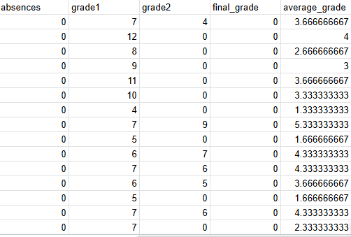

# Data Transformation
To improve the analysis, additional derived columns were created.
A new column called parent_education was created to represent the highest educational level attained by either parent.
I achieved this on google sheets using the formula:

=ARRAYFORMULA(IFS(
  MAX(SWITCH(H2:H, "Higher", 4, "Secondary", 3, "5th_to_9th grade", 2, "Primary", 1, 0), SWITCH(I2:I, "Higher", 4, "Secondary", 3, "5th_to_9th grade", 2, "Primary", 1, 0)) = 4, "Higher",
  MAX(SWITCH(H2:H, "Higher", 4, "Secondary", 3, "5th_to_9th grade", 2, "Primary", 1, 0), SWITCH(I2:I, "Higher", 4, "Secondary", 3, "5th_to_9th grade", 2, "Primary", 1, 0)) = 3, "Secondary",
  MAX(SWITCH(H2:H, "Higher", 4, "Secondary", 3, "5th_to_9th grade", 2, "Primary", 1, 0), SWITCH(I2:I, "Higher", 4, "Secondary", 3, "5th_to_9th grade", 2, "Primary", 1, 0)) = 2, "5th_to_9th grade",
  MAX(SWITCH(H2:H, "Higher", 4, "Secondary", 3, "5th_to_9th grade", 2, "Primary", 1, 0), SWITCH(I2:I, "Higher", 4, "Secondary", 3, "5th_to_9th grade", 2, "Primary", 1, 0)) = 1, "Primary",
  TRUE, "None"
))

# Performance consistency tracking
The students performance were found to be consistent from grade1, grade2 to the final grade.
## SQL query used
SELECT	
    CASE
        WHEN grade1 < 10 AND grade2 < 10 THEN 'Consistently Low'
        WHEN grade1 >= 10 AND grade2 >= 10 THEN 'Consistently High'
        ELSE 'Mixed'
    END AS performance_pattern,
    COUNT(*) AS freq,
    ROUND(AVG(average_grade), 2) AS avg_grade,
    ROUND(AVG(final_grade), 2) AS avg_final_grade
FROM nozeroes
GROUP BY performance_pattern;

# Student Demographics
Students residing in urban areas account for approximately 78% of the dataset.
Due to this significant demographic imbalance, the address attribute was excluded from the performance analysis to avoid skewed results.
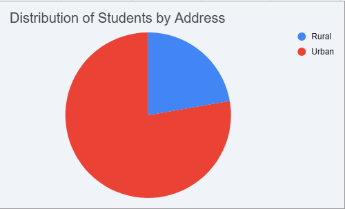

# Academic performance analysis
## Absences vs student performance
Students with higher absenteeism generally had lower average grades.
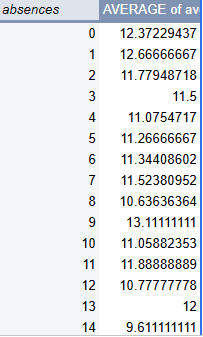

## Age vs student performance
Student performance appears to be inversely proportional to age.
Older students generally recorded lower average grades.
Older students also showed higher absenteeism rates.
## SQL query used
SELECT age,
       ROUND(AVG(final_grade),2) AS average_grade,
       ROUND(AVG(absences),2) AS average_absences
FROM nozeroes
GROUP BY age
ORDER BY age;
## Interpretation
Higher absenteeism among older students may contribute to reduced academic performance.
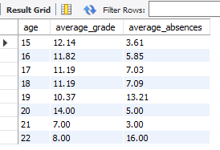

## Paid tutoring vs student performance
Paid tutoring did not significantly improve overall student performance.
## Interpretation
Academic success may depend more on study habits and motivation than external tutoring.
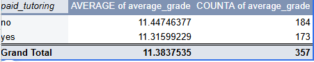

## Studytime vs student performance
Increased study time positively correlates with student performance.
Study time appears more influential than paid tutoring.
## Interpretation
Consistent independent study habits contributes more to academic success than paid tutoring.
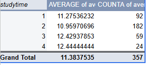

## Previous failures vs student performance
Students with previous academic failures consistently performed poorly.
## Interpretation
Past academic struggles may predict future academic difficulties.
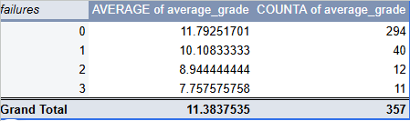

# Family and social factors
## Parent education vs student performance
Student performance positively correlates with:
-Mother's education
-Father's education
-Overall parent education
While a positive correlation exists between higher parent_education and student grades, parental cohabitation status showed no statistically significant impact on performance.
## SQL query used
SELECT parent_education,
       ROUND(AVG(average_grade),2) AS average_grade
FROM student_data
GROUP BY parent_education
ORDER BY parent_education;
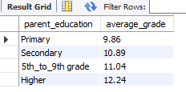
## Interpretation
Higher parental educational attainment may provide stronger academic support environments.

## Romantic status vs student performance
Romantic relationship status showed no significant impact on academic performance. They had a slightly lower mean averag grade than single students
Students in relationships recorded higher absenteeism.
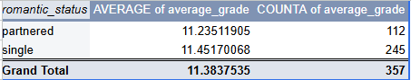

# Lifestyle and behavioural factors
## Going out frequency vs student performance
Higher social activity (go_out) negatively correlates with student performance.
Also students with high social activity were found to have lower study time.
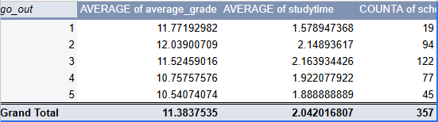
## Interpretation
Excessive social outings may reduce study time and academic focus.

## Alcohol consumption vs student performance
Students with higher alcohol consumption generally recorded lower academic performance.
## Interpretation
Lifestyle choices may significantly impact educational outcomes.
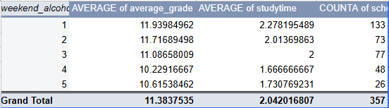

## Higher education intention
Only 14 students do not intend to pursue higher education. 
These students had a significantly lower average than the overall class performance.
## Interpretation
Long-term educational goals positively influence academic discipline and performance.
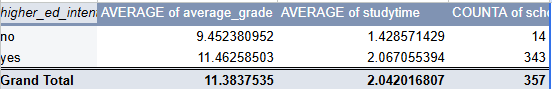

# Outlier investigations
While high absences and low study time were seen to be a common trait among poor performers, this specific query isolated outliers who achieve above-average grades despite high absenteeism and minimal study time. These outliers constituted a negligible minority of the dataset
SQL Query used
SELECT
    age,
    address,
    traveltime,
    absences,
    average_grade,
    studytime
FROM nozeroes
WHERE absences > 15
  AND studytime < 3
  AND average_grade >= 10
ORDER BY average_grade DESC;
This query returned only 12 rows
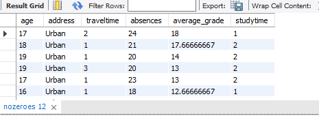

  ` 

